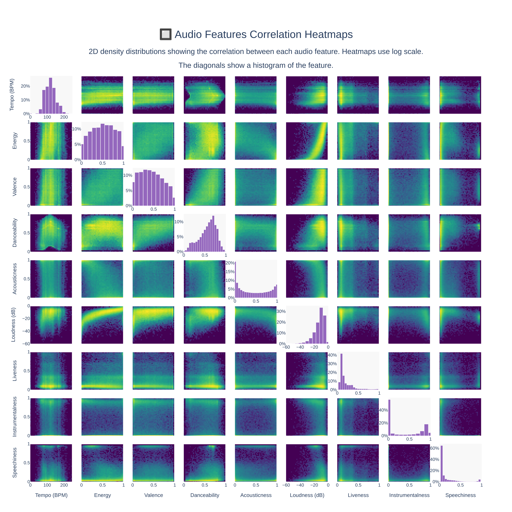
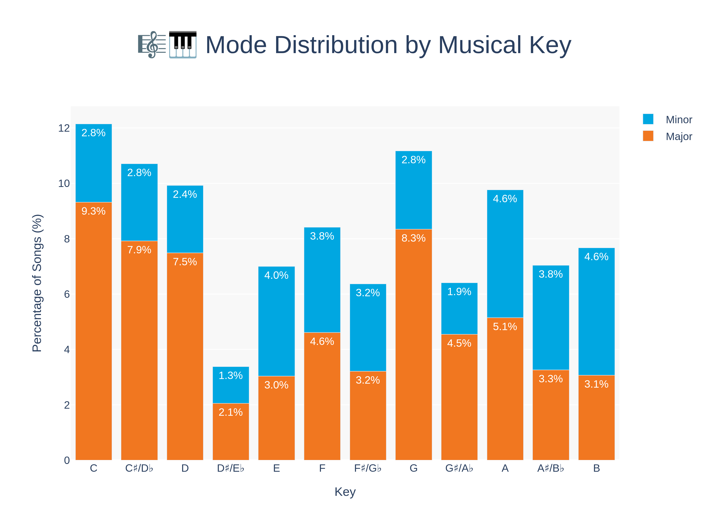
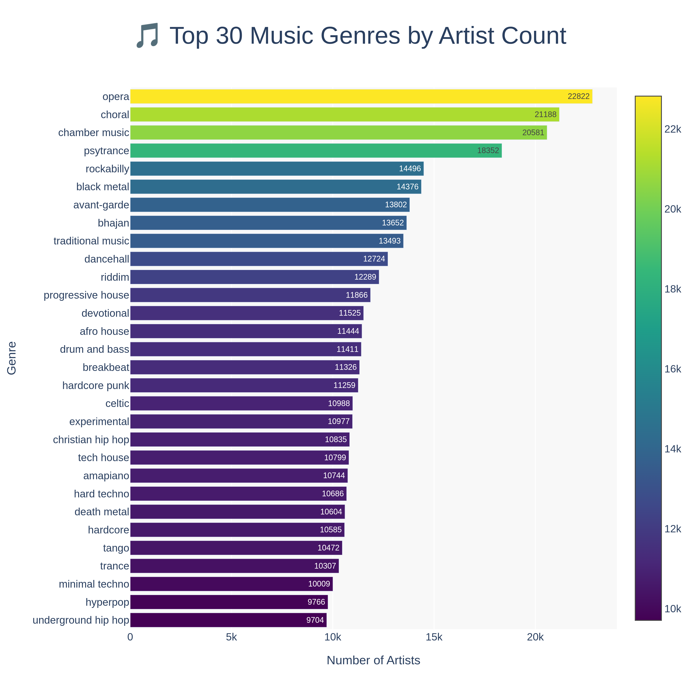

# playlist_analysis
A deep dive into music playlists from a leading streaming service, explorings questions like:

* What makes a playlist good?
* do own-brand playlists really flow better?
* Why do rock music recomendations kinda suck?

## Data overview

As well as the playlist level information (how many followers does a playlist have, what tracks and order), there is a large set of data on tracks, artists and audio features.

## Track level information
### Describing artists, popularity, streams etc.,

## Audio feature information
### Specific features derived from the audio such as key, tempo etc.. as well as estimates on danceability, instrumentalness etc..

## Artist level information
### Primarily interested in genres - genres are given on a per artist level, some artists have more than on genre. With over 700 genres there is a lot of nuance here.

